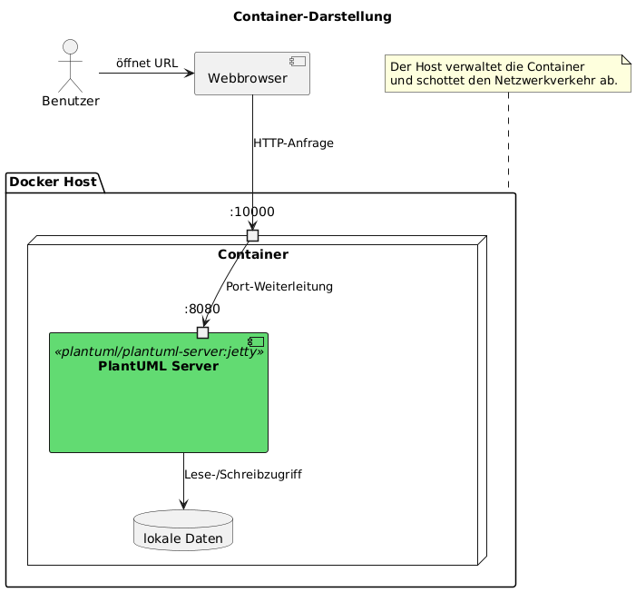

# PlantUML-Übung 1

Versuchen Sie, das folgende Diagramm möglichst gleich mit PlantUML-Code abzubilden:

Achten Sie auf die korrekten Elemente, Beschriftungen, Anordnung, Farben (in etwa).

Dies ist ein Beispiel eines Komponenten-Diagramm, wie wir es zu Dokumentationszwecken auch im Unterricht erstellen werden.

Studieren Sie dazu die Dokumentation von PlantUML: <https://plantuml.com/de/component-diagram>

**Abgabe**

Laden Sie den PlantUML-Quellcode und das daraus resultierende Bild als Datei oder in der Textabgabe hoch.