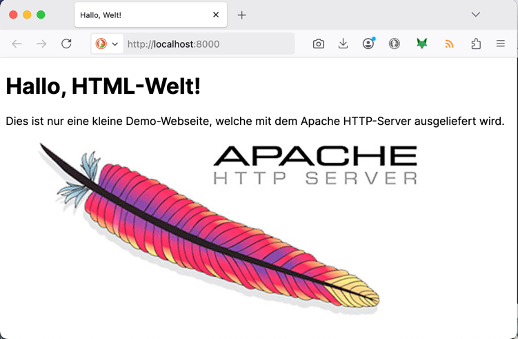

# Image vom Dockerhub in Betrieb nehmen - http

Der [Dockerhub](https://hub.docker.com/) ist die erste Anlaufstelle für fertig konfigurierte **Container-Images**. Sie finden dort Tausende
von bereits vorkonfigurierten Images, welche Sie nutzen können.

Wenn Sie `docker pull [imagename]` oder `docker run .... [imagename]` ausführen, prüft Docker erst, ob das Image bereits lokal vorhanden ist. Wenn nicht, holt sich Docker das Image (standardmässig) vom Dockerhub.

Wir probieren dies heute mit einem ganz einfachen Image aus: mit einem Web-Server (dem Apache HTTP-Server), der einfach statische Files (HTML, CSS, Bilder etc...) ausliefern kann.

## Aufgabe

* Sie erstellen einen Container, der einen Webserver bereitstellt und danach unter http://localhost:8000 ein Demo-HTML-File ausliefert. **Erstellen Sie selbständig ein kleines HTML-File mit Beispiel-Inhalt!**
* Sie verwenden dazu das Image **`httpd`** (Apache HTTP Server, https://hub.docker.com/_/httpd/): 
Apache HTTP ist ein leichtgewichtiger Webserver, der statische HTML-Seiten ausliefern kann.
* Machen Sie sich auf der Dockerhub-Seite von httpd schlau, wie / wo Sie den Ordner mit den HTML-Files platzieren müssen
* Konfigurieren Sie den neuen Container so, dass dieser Ihr(e) lokalen HTML-Seiten ausliefern kann!
* Machen Sie ein **PlantUML-Diagramm*, welches die Komponenten (Docker-Host, Container, Client, Ports) aufzeigt! Es soll aufzeigen:
  * welche(r) Container läuft
  * welche Ports dabei wie gemappt werden
  * Beziehung zwischen Browser und Container ist ersichtlich

**Sie erarbeiten sich das Wissen dazu selbständig.**

## Was müssen Sie sich für Wissen aneignen?

* Grundsätzlich: wie erstellen Sie einen Container mit dem httpd-Image? 
  Infos dazu: <https://hub.docker.com/_/httpd/>

* Wie konfigurieren Sie ein Port-Mapping, damit Sie von Ihrem Host (localhost) TCP Port 8000 an den Container-Port 80 weiterleiten können? 
Infos dazu: <https://docs.docker.com/engine/reference/commandline/run/#publish>

* Wie konfigurieren Sie ein Volume Mapping, sodass Ihr lokaler Folder mit der Web-Applikation dem Web-Server zur Verfügung gestellt werden kann? 
Infos dazu: <https://docs.docker.com/engine/reference/commandline/run/#volume>

## Ziel

Beim Öffnen des Links http://localhost:8000 sollte Ihre Demo-Webseite angezeigt werden:

## Abgabe

Geben Sie das dazu notwendige Docker-Kommando und die zugehörigen Files in der Moodle-Aufgabe (text + zip) ab!