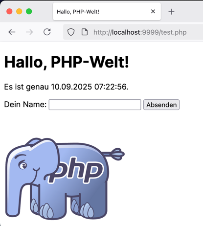

# Image vom Dockerhub in Betrieb nehmen - php

Der [Dockerhub](https://hub.docker.com/) ist die erste Anlaufstelle für fertig konfigurierte **Container-Images**. Sie finden dort Tausende
von bereits vorkonfigurierten Images, welche Sie nutzen können.

Wenn Sie `docker pull [imagename]` oder `docker run .... [imagename]` ausführen, prüft Docker erst, ob das Image bereits lokal vorhanden ist. Wenn nicht, holt sich Docker das Image (standardmässig) vom Dockerhub.

Wir probieren dies heute mit einem Image aus, welches Ihnen ein Web-Server zur Verfügung stellt, der die Programmiersprache [PHP](https://php.net) versteht: PHP stellt dazu ein offizielles Image auf dem Dockerhub zur Verfügung.

## Aufgabe

* Sie erstellen einen Container, der einen PHP-fähigen Webserver bereitstellt und danach unter http://localhost:8000 ein Demo-PHP-Programm ausliefern kann. **Ein Demo-PHP-Programm finden Sie [unten als Beispiel](./test.php). Wenn Sie schon PHP können, dürfen Sie gerne ein eigenes kleines Script machen!**
* Sie verwenden dazu das Image **`php`** in der Version `8.4-apache` (PHP, vom Apache HTTP-Server ausgeliefert, https://hub.docker.com/_/php/): 
Apache HTTP ist ein leichtgewichtiger Webserver, der statische HTML-Seiten ausliefern kann. Das Image konfiguriert Apache bereits so, dass er PHP-Dateien interpretieren kann.
* Machen Sie sich auf der Dockerhub-Seite von php schlau, wie / wo Sie den Ordner mit den Files platzieren müssen
* Konfigurieren Sie den neuen Container so, dass dieser Ihr(e) lokalen Scripte ausliefern kann!
* Machen Sie ein **PlantUML-Diagramm*, welches die Komponenten (Docker-Host, Container, Client, Ports) aufzeigt! Es soll aufzeigen:
  * welche(r) Container läuft
  * welche Ports dabei wie gemappt werden
  * Beziehung zwischen Browser und Container ist ersichtlich

**Demo-PHP-Script zum Download:** [test.php](./test.php)

**Sie erarbeiten sich das Wissen dazu selbständig.**

## Was müssen Sie sich für Wissen aneignen?

* Grundsätzlich: wie erstellen Sie einen Container mit dem php-Image? 
  Infos dazu: <https://hub.docker.com/_/php/>

* Wie konfigurieren Sie ein Port-Mapping, damit Sie von Ihrem Host (localhost) TCP Port 8000 an den Container-Port 80 weiterleiten können? 
Infos dazu: <https://docs.docker.com/engine/reference/commandline/run/#publish>

* Wie konfigurieren Sie ein Volume Mapping, sodass Ihr lokaler Folder mit der Web-Applikation dem Web-Server zur Verfügung gestellt werden kann? 
Infos dazu: <https://docs.docker.com/engine/reference/commandline/run/#volume>

## Ziel

Beim Öffnen des Links http://localhost:8000 sollte Ihre Demo-Webseite angezeigt werden, welche von PHP erzeugt wurde

## Abgabe

Geben Sie das dazu notwendige Docker-Kommando und die zugehörigen Files in der Moodle-Aufgabe (text + zip) ab!