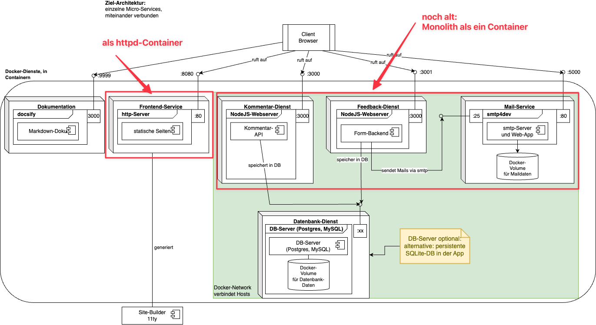

# Einstieg - Ziel von letzter Lektion


## M293-site mit httpd

Sie haben mit dem `httpd`-Image einen Container gestartet. Der Container liefert nun die statischen Dateien aus dem Projekt M293 aus.

**Kommando zum Erstellen des Containers:**


```sh
cd frontend/
docker run --name m347-frontend -d -p 9090:80 -v "$(pwd)/site/":/usr/local/apache2/htdocs/ httpd
```

**Kommando zum Starten/Stoppen des Containers:**

```sh
docker stop m347-frontend
docker start m347-frontend
```

## Feedback- und DB-Demo in statische Seite integriert

Sie haben das Feedback-Formular (Abgabe auf Moodle: `formular/index.html`) und die DB-Demo (Abgabe auf Moodle: `db-demo/index.html`) in die statische Seite eingebaut, und diese sind über die Webseite erreichbar.

## Monolith als Container

Sie können die Monolith-Applikation als Container erstellen und starten. Dieser bedient die beiden
Frontend-Formulare (Feedback und DB-Demo).

**Kommando zum Erstellen des Containers:**

```sh
cd monolith
npm install # einmalig, damit die Packages installiert sind
docker run --name m347-monolith -ti -v "$(pwd):/app" -w /app -p 3000:3000 node:20 node server.js
```

**Danach können Sie diesen Container jeweils erneut starten und beenden:**

```sh
docker stop m347-frontend
docker start m347-frontend
```

