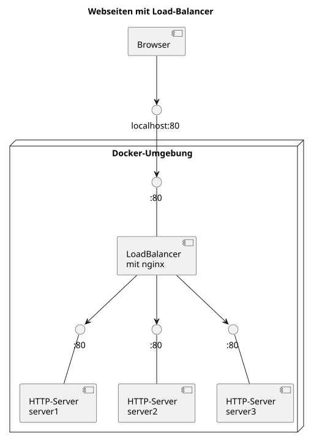

# Übung - Webseite mit Load-Balancer

## Ziel, Aufgabe

Wir wollen ein gängiges Szenario, welches Sie in vielen Web-Applikationen vorfinden, aufbauen:



Wir starten 3 Instanzen eines `httpd`-Web-Servers (Apache httpd, den kennen Sie auch bereits aus vorgängigen Lektionen), und wollen die Netzwerk-Last mittels `nginx`-Load-Balancer verteilen (`nginx` ist ebenfalls ein Webserver, kann aber auch einfach load-balancen).

Zudem sollen die Web-Container untereinander getrennt sein, nur mit dem Load-Balancer verbunden sein (aus Sicherheitsgründen).

## Aufbau

* Erstellen Sie 3 Webserver-Container mit dem [`httpd`](https://hub.docker.com/_/httpd)-Image (das kennen Sie schon). Erstellen Sie eine **EIGENE** Seite pro Server, z.B. mit dem HTML-Inhalt **"Server 1"**, **"Server 2"**, **"Server3"**: Dies macht das Testen / Sichtbarmachen der Load-Balancer-Verteilung einfacher.

* Erstellen Sie den Load-Balancer mittels [`nginx`](https://hub.docker.com/_/nginx)-Image. Damit dieser als Load-Balancer konfiguriert werden kann, definieren Sie eine `.conf`-Datei und mounten diese beim Container-Start unter `/etc/nginx/nginx.conf`:


```txt
# nginx.conf:
worker_processes  auto;
http {
    upstream mywebapp {
        server server1;
        server server2;
        server server3;
    }

    server {
        listen 80;

        location / {
            proxy_pass http://mywebapp;
        }
    }
}
events {
    worker_connections  1024;
}
```

... also _**in etwa**_ so:

`docker run [... weitere parameter ...] -v /pfad/zum/lokalen/nginx.conf:/etc/nginx/nginx.conf nginx` 

**Sorgen Sie für die notwendigen (aber nicht mehr) Netzwerk-Verbindungen!**

## Test

Öffnen Sie nun die Seite über Ihren Browser (<http://localhost/>), und prüfen Sie, welche Seite Sie erhalten.

Laden Sie die Seite ein paar Mal neu - können Sie die Funktionalität des Load-Balancers bestätigen? Wie? Warum (nicht)?

## Dokumentation

Erstellen Sie ein PlantUML-Diagramm (analog dem oben gezeigten) mit der soeben aufgebauten Architektur! Zusätzlich haben Sie hier noch Daten mittels Volume Bind eingebunden - zeichnen Sie auch diese Volume-Binds / Mounts ein! Überlegen Sie sich, wie Sie dies mit PlantUML machen können!

## Abgabe

* die notwendigen Docker-Kommandos
* die zugehörigen Dateien
* das dokumentierende PlantUML-Diagramm als Bild (nicht als Code)


