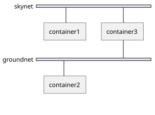

# Übung - Container in mehreren Netzwerken

**Erstellen Sie 3 Container** von dem bereits bekannten `jonlabelle/network-tools`-Image (Netzwerk-Tools), und konfigurieren Sie diese netzwerkmässig wie folgt:

* `container1` ist im Netzwerk `skynet`
* `container2` ist im Netzwerk `groundnet`
* `container3` ist in beiden Netzwerken

**Notieren Sie die dazu notwendigen Kommandos!**

**Verifizieren Sie den Netzwerk-Zugriff:**

Mittels `ping [hostname|ipadresse]` (also z.B. `ping container1`) können Sie prüfen, ob ein entfernter Host grundsätzlich erreichbar ist.

* Versuchen Sie, mittels des `ping`-Befehls aus `container1` den `container2` zu erreichen. Funktioniert dies?
* Versuchen Sie, mittels des `ping`-Befehls aus `container1` den `container3` zu erreichen. Funktioniert dies?
* Versuchen Sie, mittels des `ping`-Befehls aus `container2` den `container1` zu erreichen. Funktioniert dies?
* Versuchen Sie, mittels des `ping`-Befehls aus `container2` den `container3` zu erreichen. Funktioniert dies?
* Versuchen Sie, mittels des `ping`-Befehls aus `container3` den `container1` zu erreichen. Funktioniert dies?
* Versuchen Sie, mittels des `ping`-Befehls aus `container3` den `container2` zu erreichen. Funktioniert dies?

**--> Was stellen Sie fest? Welche Container haben Zugriff auf welche anderen, und warum?**

