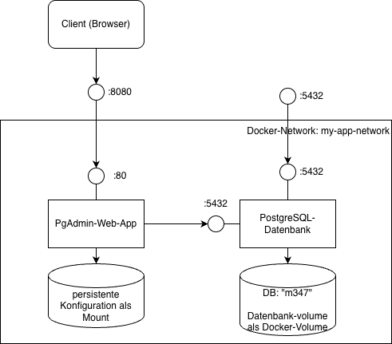

# Compose-Übung: Datenbank-Server mit Web-UI

Diese Übung dient dazu, Ihnen das notwendige Wissen rund um docker compose, also die Dienstorchestrierung, beizubringen.

Sie eignen sich das Wissen dazu (docker compose) selbständig und unter Zuhilfenahme der Doku-Pointer, Internet etc. selbständig an.

## Ziel

Sie erstellen einen PostgreSQL-Datenbank-Dienst mit zugehörigem Datenbank-Frontend-Tool (PgAdmin).

PostgreSQL ist die fortschrittlichste OpenSource-Datenbank und findet sich in Millionen von Applikationen wieder.
Wir wollen hier PostgreSQL als Docker-Dienst zur Verfügung stellen, und dabei ein vorkonfiguriertes Web-Admin-Tool gleich dazu.

## Vorgaben

Sie erstellen ein docker compose-Projekt mit folgenden Vorgaben:

* ein Dienst (Container), welcher die Datenbank **PostgreSQL** zur verfügung stellt
* ein Dienst, der **PgAdmin**, das offizielle PostgreSQL-Management-Tool, zur Verfügung stellt
* **Datenbank** (PostgreSQL, siehe <https://hub.docker.com/_/postgres/>)
  * exponiert den Port "5432" (Standardport)
  * nutzt die Lokalisierung "**de_CH.utf8**" (Schweiz/Deutsch), siehe <https://hub.docker.com/_/postgres/#locale-customization>
  * legt eine (leere) Datenbank `m347` an, mit der oben genannten Locale (damit korrekt nach deutschen Regeln sortiert wird)
  * speichert die Datenbank-Daten persistent in einem Docker-Volume

* **PgAdmin** (siehe <https://hub.docker.com/r/dpage/pgadmin4>)
  * exponiert den Port 80 als "8080" für den Web-Zugriff
  * verbindet mit dem Datenbank-Server über ein internes Docker Network
  * nutzt ein vorkonfiguriertes `servers.json`, welches den Server und die Zugangsdaten konfiguriert.
* beide Dienste zusammen können über ein einfaches `docker compose up` gestartet werden
* (optional) **Demo-Daten**: 
 Importieren Sie den Demo-Datensatz der `chinook`-Datenbank, damit Sie ein paar Daten als Demonstration nutzen können:
<https://github.com/neondatabase-labs/postgres-sample-dbs?tab=readme-ov-file#chinook-database>

## Tests

* Sie können PgAdmin über den Port 8080 via Webbrowser erreichen
* Sie können in PgAdmin einloggen
* Die Verbindung zur Datenbank ist vorkonfiguriert
* Die Verbindung zur Datenbank funktioniert (kann geöffnet werden)
* Sie sehen den Inhalt der (leeren) Datenbank über PgAdmin
* Der Datenbank-Dienst ist ebenfalls direkt via Port 5432 erreichbar

## Abgabe / Artefakte

* alle notwendigen Dateien in einem Ordner, gezippt
* das Zip muss extrahiert werden können, und mit einem einfachen `docker compose up` alle Dienste erstellt werden können

## Doku-Pointer

* Manual Docker Compose: <https://docs.docker.com/compose/>
* Compose File Reference: <https://docs.docker.com/reference/compose-file/>
* PostgreSQL-Docker: <https://hub.docker.com/_/postgres/>
* PgAdmin-Docker: <https://hub.docker.com/r/dpage/pgadmin4>
* PgAdmin-Installation in Docker: <https://www.pgadmin.org/docs/pgadmin4/latest/container_deployment.html>

## Bonus

Die oben gezeigte `chinook`-Demo-Datenbank soll bereits beim ersten Start des Containers automatisch importiert werden: Ergänzen Sie Ihre docker (compose)-Konfiguration so, dass der Restore der Daten automatisch beim ersten Start geschieht.

Doku-Pointer dazu:

* Datenbank (wie oben): <https://github.com/neondatabase-labs/postgres-sample-dbs?tab=readme-ov-file#chinook-database>
* Initial-Restore: <https://hub.docker.com/_/postgres/#initialization-scripts>